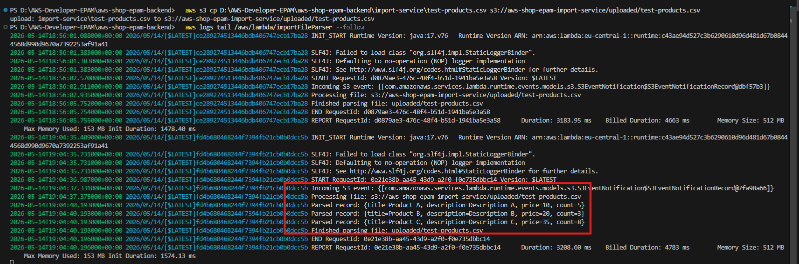

# AWS Shop Backend

CloudFront link - https://d1ondnw0chspyw.cloudfront.net/

## Tasks

### Task 3.1 ✅  

Create a lambda function called `getProductsList` under the same AWS CDK Stack file of Product Service which will be triggered by the HTTP GET method.

- The requested URL should be `/products`.
- The response from the lambda should be a full array of products (mock data should be used - this mock data should be stored in Product Service).
- This endpoint should be integrated with Frontend app for PLP (Product List Page) representation.

### Task 3.2 ✅  

Create a lambda function called `getProductsById` under the same AWS CDK Stack file of Product Service which will be triggered by the HTTP GET method.

- The requested URL should be `/products/{productId}` (what `productId` is in your application is up to you - productName, UUID, etc.).
- The response from the lambda should be 1 searched product from an array of products (mock data should be used - this mock data should be stored in Product Service).
- This endpoint is not needed to be integrated with Frontend right now.

### Swagger Documentation ✅  

OpenAPI 3.0 documentation for the Product Service API is available in [`openapi.yaml`](./openapi.yaml).

To view it, open [https://editor.swagger.io/](https://editor.swagger.io/) and import the file via **File → Import file**.

---

### Task 3.3 ✅  
Commit all your work to separate branch (e.g. `task-3` from the latest master) in your own repository.

Create a pull request to the master branch.

Submit link to the pull request to Crosscheck page in RS App.


### Task 4.1 ✅  
-  Use AWS Console to create two database tables in DynamoDB. Expected schemas for products and stocks:
Product model:

  products:
    id -  uuid (Primary key)
    title - text, not null
    description - text
    price - integer
Stock model:

  stocks:
    product_id - uuid (Foreign key from products.id)
    count - integer (Total number of products in stock, can't be exceeded)
- Write a script to fill tables with test examples. Store it in your Github repository. Execute it for your DB to fill data.

### Task 4.2 ✅  
- Extend your AWS CDK Stack with data about your database table and pass it to lambda’s environment variables section.
- Integrate the getProductsList lambda to return via GET /products request a list of products from the database (joined stocks and products tables).
- Implement a Product model on FE side as a joined model of product and stock by productId. For example:

BE: Separate tables in DynamoDB

  Stock model example in DB:
  {
    product_id: '19ba3d6a-f8ed-491b-a192-0a33b71b38c4',
    count: 2
  }


  Product model example in DB:
  {
    id: '19ba3d6a-f8ed-491b-a192-0a33b71b38c4'
    title: 'Product Title',
    description: 'This product ...',
    price: 200
  }
FE: One product model as a result of BE models join (product and it's stock)

  Product model example on Frontend side:
  {
    id: '19ba3d6a-f8ed-491b-a192-0a33b71b38c4',
    count: 2
    price: 200,
    title: ‘Product Title’,
    description: ‘This product ...’
  }
NOTE: This setup means User cannot buy more than product.count (no more items in stock) - but this is future functionality on FE side.

- Integrate the getProductsById lambda to return via GET /products/{productId} request a single product from the database.

### Task 4.3 ✅  
- Create a lambda function called createProduct under the Product Service which will be triggered by the HTTP POST method.
- The requested URL should be /products.
- Implement its logic so it will be creating a new item in a Products table.
- Save the URL (API Gateway URL) to execute the implemented lambda functions for later - you'll need to provide it in the PR (e.g in PR's description) when submitting the task.

```
POST https://byb2npd55e.execute-api.eu-central-1.amazonaws.com/prod/products
Content-Type: application/json

{
  "title": "New Product by POST-1",
  "description": "Product description",
  "price": 99.99,
  "count": 10
}

Response will be with id and with 201 Status:
{
    "id": "ceead6c2-5ad0-4f46-a36e-ef92d234b7c5",
    "title": "New Product by POST-1",
    "description": "Product description",
    "price": 99.99,
    "count": 10
}
```
✅  POST /products lambda functions returns error 400 status code if product data is invalid
✅  All lambdas return error 500 status code on any error (DB connection, any unhandled error in code)
✅  All lambdas do console.log for each incoming requests and their arguments
✅  Transaction based creation of product (in case stock creation is failed then related to this stock product is not created and not ready to be used by the end user and vice versa)

### Task 5.1 ✅  

- Create a new service called import-service at the same level as Product Service with its own AWS CDK Stack. The backend project structure should look like this:
   backend-repository
      product-service
      import-service
- In the AWS Console create and configure a new S3 bucket with a folder called uploaded.
- s3://aws-shop-epam-import-service/uploaded/
- arn:aws:s3:::aws-shop-epam-import-service/uploaded/
